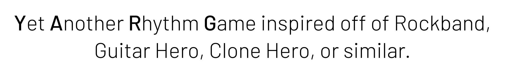

> **Warning**
>
> YARG is **not done yet**! Expect incomplete features and bugs!

<br/>
<div align="center">


<br/>
<br/>
<a href="https://twitter.com/EliteAsian123">

</a>
<a href="https://discord.gg/sqpu4R552r">

</a>
<br/>
<br/>



</div>

# 👉 Disclaimer

We **DO NOT** encourage, advocate, or promote **PIRATING** of songs, or of anything else. This game's intended use is for you, the player, to play songs that you already own. This means, ripping songs of a game **YOU OWN** for **YOURSELF** for **PERSONAL USE**, or downloading creative commons/public domain songs off of the internet.

**YARG** has nothing to do with pirates. It stands for "Yet Another Rhythm Game."

# 📥 Downloading and Playing

**An official installation video is [available here](https://www.youtube.com/watch?v=bSPSttKNnKc).**<br/> 
A community made one is available as well, [here](https://youtu.be/hEJHuAGGlD8).

Windows:
1. [Click here](https://github.com/EliteAsian123/YARG/releases) to view all releases.
2. Download the lastest zip file by clicking on the "Assets" dropdown and then clicking on `YARG_vX.X.X.zip`.
3. Extract the contents of the zip file by right clicking it and pressing "Extract All..."
4. Click "Extract".
5. Open the extracted folder and double-click `YARG.exe` (if you don't have file extensions on, it is called just `YARG`)
6. You may get a "Windows protected your PC" error. This is because not many people have ran the program before, so Windows does not know if it is harmful or not. Click on "More info" and then "Run anyway" to run YARG anyways. If you don't trust me, please feel free to scan the folder with an anti-virus. Please note that some anti-viruses may have the same problem as Windows.
7. Once you load in, click on "SETTINGS"
9. Then, click on "Open Song Folder Manager"
9. Next, click on "Add Folder." A new text box should pop-up. This is where your songs will come from.
10. Choose your song folder. You can browse folder by click on the folder icon.
11. Once you've chosen your folder, click on "Select Folder". Please be sure that the folder has at least one song in it.
12. YARG will cache all of the files in the folder you chose. Doing this may take a while depending on the amount of songs you have. If you ever add more songs, **be sure** to go to "SETTINGS" and then click on "Refresh All Caches".
12. Next click on "ADD/EDIT PLAYERS".
    1. Click on "Add Player"
    2. Then click on the device you will be playing with.
    3. Click on the dropdown and select what type of instrument you will be playing (i.e. "Five Fret", "Microphone", etc.)
    4. Depending on the input type, you may have to bind keys. To do this, click on each button and press the key of choice on your controller.
13. Finally, click on "QUICKPLAY".
14. Have fun!

# 🔨 Building

> **Warning**
>
> If you would like to build the game yourself, please follow these instructions.
>
> If you don't follow these instructions, **YOU WILL NOT BE ABLE TO RUN THE GAME**.

1. Make sure you have the latest version of [Blender](https://www.blender.org/) installed. This is for loading models, even if you don't plan on editing them.
2. Make sure you have [Python (3.10)](https://www.python.org/downloads/) installed. This is required to downloading dependencies.
3. Clone the repository. If you don't know how to do this:
	1. Download [Git](https://git-scm.com/downloads).
	2. Open the command prompt in the directory you want to store the repository.
	3. Type in `git clone https://github.com/EliteAsian123/YARG.git`.
4. Install Unity Hub and Unity `2021.3.21f1` (LTS).
	1. Download and install [Unity Hub](https://unity.com/download).
	2. Sign-in/create an account with a personal license (free).
	3. In Unity Hub, click on "Install Editor" and select `2021.3.21f1` (LTS). It may be favourable to unselect Visual Studio if you are not using it.
	4. Click "Install"
5. Open the command prompt at the root of the repo, and type in:
	1. `pip install requests`
	2. `python InstallLibraries/install.py`. This may take a bit. Wait for the command prompt to say "Done!" before closing. This installs all needed dependencies for you.
6. Open the project in Unity (select "Open" and select YARG's repo's folder).
7. Load in **without** entering safe mode. Click "Ignore".
8. (You may need to) click on `NuGet` on the menu bar, then click on `Restore Packages`.
9. You're ready to go!

> **Note**
>
> If you plan on merging branches, I highly recommend following these instructions for easier merges.

Setup:
1. Open a command prompt to the repository (on VS Code you can do Terminal > New Terminal)
2. Type in `git config --local --edit`
3. In the file that gets opened, go to the bottom and paste this in: (You may need to change the file path depending on where you installed Unity to)
```
[merge]
    tool = unityyamlmerge
[mergetool "unityyamlmerge"]
    trustExitCode = false
    cmd = 'C:\\Program Files\\Unity\\Hub\\Editor\\2021.3.21f1\\Editor\\Data\\Tools\\UnityYAMLMerge.exe' merge -p "$BASE" "$REMOTE" "$LOCAL" "$MERGED"
```
4. Save and close the file.

Resolving conflicts:
1. Start the merge/cherry-pick which is causing conflicts.
2. If the conflict doesn't resolve automatically, open the command prompt and use `git merge-tool`.
3. Verify that the conflict was resolved correctly, then commit/continue the merge.

# ✍️ Contributing

If you want to contribute, please feel free! Please join [our Discord](https://discord.gg/sqpu4R552r) if you want your PR/Art merged.

# 🛡️ License

YARG is licensed under the MIT License - see the [`LICENSE`](../master/LICENSE) file for details.

# 🧰 External Licenses

Some libraries/assets are **packaged** with the source code have licenses that must be included.

| Library | License |
| --- | --- |
| [NuGet for Unity](https://github.com/GlitchEnzo/NuGetForUnity) | [MIT](https://github.com/GlitchEnzo/NuGetForUnity/blob/master/LICENSE)
| [Unity Standalone File Browser](https://github.com/gkngkc/UnityStandaloneFileBrowser) | [MIT](https://github.com/gkngkc/UnityStandaloneFileBrowser/blob/master/LICENSE.txt)
| [Discord GameSDK](https://discord.com/developers/docs/game-sdk/sdk-starter-guide) | Licenseless
| [Lucide](https://lucide.dev/) | [ISC](https://lucide.dev/license)
| [DtxCS](https://github.com/maxton/DtxCS) | Licenseless
| [Moonscraper](https://github.com/FireFox2000000/Moonscraper-Chart-Editor) | [BSD 3-Clause License](https://github.com/FireFox2000000/Moonscraper-Chart-Editor/blob/master/LICENSE)

Please note that other libraries are **not** packaged within the source code, and are to be install by NuGet.

BASS is the audio library for YARG. [It has it's own license for release](https://www.un4seen.com/).

# 📦 External Assets and Libraries

| Link | Type | Use |
| --- | --- | --- |
| [Unbounded](https://fonts.google.com/specimen/Unbounded) | Font | Combo/Multipier Meter
| [Barlow](https://fonts.google.com/specimen/Barlow) | Font | UI Font
| [Material Symbols](https://fonts.google.com/icons) | Icons | UI Icons
| [Lucide](https://lucide.dev/) | Icons | UI Icons
| [PolyHaven](https://polyhaven.com/) | Assets | Textures and Models
| [PlasticBand](https://github.com/TheNathannator/PlasticBand) | Reference | Controller Support Info
| [PlasticBand-Unity](https://github.com/TheNathannator/PlasticBand-Unity) | Library | GH/RB Controller Support
| [HIDrogen](https://github.com/TheNathannator/HIDrogen) | Library | Linux HID Controller Support
| [GuitarGame_ChartFormats](https://github.com/TheNathannator/GuitarGame_ChartFormats) | Reference | File Format Documentation
| [NuGet for Unity](https://github.com/GlitchEnzo/NuGetForUnity) | Library | NuGet Packages in Unity
| [EliteAsian's Unity Extensions](https://github.com/EliteAsian123/EliteAsians-Unity-Extensions) | Library | Utility
| [Unity Standalone File Browser](https://github.com/gkngkc/UnityStandaloneFileBrowser) | Library | "Browse" Button
| [FuzzySharp](https://www.nuget.org/packages/FuzzySharp) | Library | Search Function
| [ini-parser](https://www.nuget.org/packages/ini-parser-netstandard) | Library | Parsing `song.ini` Files
| [DryWetMidi](https://www.nuget.org/packages/Melanchall.DryWetMidi) | Library | Parsing `.mid` Files
| [TagLibSharp](https://www.nuget.org/packages/TagLibSharp) | Library | Finding Audio Metadata
| [Minis](https://github.com/keijiro/Minis/tree/master) | Library | MIDI Input for Unity
| [Discord GameSDK](https://discord.com/developers/docs/game-sdk/sdk-starter-guide) | Library | Discord Rich Presence
| [DtxCS](https://github.com/maxton/DtxCS) | Library | Parsing `.dta` Files
| [Moonscraper](https://github.com/FireFox2000000/Moonscraper-Chart-Editor) | Library | Parsing `.chart` Files

# 💸 Donate

Some people have expressed interest in donating. This is an open-source project and therefore donating is not required. If you do want to still help out, spread the word or contribute!
