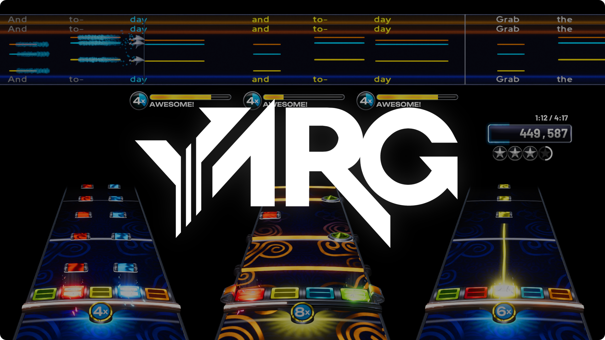
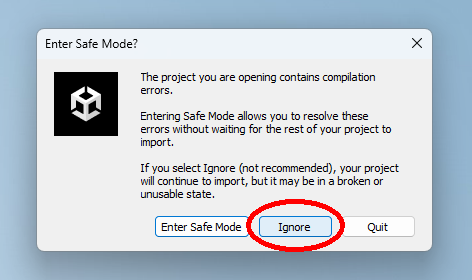

<p align="center">
  <picture>
    
  </picture>
</p>

<p align="center">
    <i>YARG (a.k.a. Yet Another Rhythm Game)</i>
</p>

<p align="center">
  <a href="https://twitter.com/YARGGame">
    
  </a>
  <a href="https://discord.gg/sqpu4R552r">
    
  </a>
  <a href="https://reddit.com/r/yarg">
    
  </a>
</p>

---

YARG (a.k.a. Yet Another Rhythm Game) is a free, open-source, plastic guitar game that is still in development. It supports guitar (five fret), drums (plastic or e-kit), vocals, pro-guitar, and more! YARG is still in active development, so there may be bugs and missing features.

## 👉 Disclaimer

> [!IMPORTANT]
> **YARG stands firmly against all forms of piracy.** We neither support nor endorse piracy, as it is a violation of copyright law with serious legal consequences. Our platform's importable content—designed for creators to share their work and for educational purposes—does not justify or excuse piracy.
>
> YARG itself **does not** use any ripped/pirated assets or music and never will. By using YARG, users agree not to promote or endorse piracy in any way through our platform. Upholding these principles ensures a community that respects copyright, creativity, and legal standards.
>
> YARG stands for "Yet Another Rhythm Game" and NOT for pirates.

## 📃 Table of Contents

- [👉 Disclaimer](#-disclaimer)
- [📃 Table of Contents](#-table-of-contents)
- [📥 Downloading and Playing](#-downloading-and-playing)
  - [YARC Launcher (All Platforms)](#yarc-launcher-all-platforms)
  - [Linux](#linux)
- [🔨 Building/Contributing](#-buildingcontributing)
  - [Setup Instructions](#setup-instructions)
  - [Unity YAML Merge Tool](#unity-yaml-merge-tool)
- [✍️ Contributing and Credits](#️-contributing-and-credits)
- [🛡️ License](#️-license)
- [🧰 External Licenses](#-external-licenses)
- [📦 External Assets and Libraries](#-external-assets-and-libraries)
- [💸 Donate](#-donate)

## 📥 Downloading and Playing

**It is recommended you download YARG via the [YARC Launcher](https://github.com/YARC-Official/YARC-Launcher/releases/).** Downloading the portable option is not recommended as some features may not work.

### YARC Launcher (All Platforms)

> [!IMPORTANT]
> If you are on Linux, there are some additional things you need to do in order for controllers to work. See the Linux section for more info.

1. Go to the YARC Launcher releases page, [here](https://github.com/YARC-Official/YARC-Launcher/releases/).
2. Click on the download option for your operating system.
3. You may get a "this application is not safe" warning depending on your operating system. This is a false positive. [Click here](https://github.com/YARC-Official/YARC-Launcher#-antivirus-warnings) to learn more.
4. Once in the launcher, click on "YARG" on the left hand side.
5. Then, click on green "Update Stable" button.
6. You will be prompted to choose an install folder. If you don't know what folder to choose, just click "Okay". Please ensure that the folder you select is empty.
7. Wait for it to finish installing...
8. Finally, press "Play Stable"!
9. Additionally, if you want some songs, install "YARG Setlist" which is also on the left in the YARC Launcher.

### Linux

There are some dependencies that will be needed in order for HID devices (such as PS3 and Wii instruments) to work.

1. Install `hidapi` and `libudev`:
   - (Package names may differ depending on package repositories.)
   - On apt-based distros (such as Ubuntu or Debian), use `sudo apt install libhidapi-hidraw0 libudev1`.
   - On pacman-based distros (such as Arch Linux), use `pacman -S hidapi systemd-libs`.
   - On Fedora, use `dnf install hidapi systemd-libs`.
2. Finally, create a new udev rules file called `69-hid.rules` inside of `/etc/udev/rules.d/` or `/usr/lib/udev/rules.d/`, with the following contents:
  ```
  KERNEL=="hidraw*", TAG+="uaccess"
  ```
  - Without this file, YARG will not be able to access HID devices without special permissions such as being run with `sudo`, which is not recommended.
  - The file name may differ if desired, but it must come before `73-seat-late.rules`!
3. Reboot your system to apply the new udev rule, then you should be all good to go!

## 🔨 Building/Contributing

> [!IMPORTANT]
> #### ⚠️ If you wish to contribute, use the `dev` branch. Your PR will NOT be merged if it's on `master`. ⚠️

### Setup Instructions

> [!WARNING]
>
> If you would like to build the game yourself, please follow these instructions.
>
> If you don't follow these instructions, it is possible that **YOU WILL NOT BE ABLE TO RUN THE GAME**.

1. If you are planning to contribute, first make a fork of the project.
   - Be sure to *uncheck* the option to only include the `master` branch! You will not be able to set things up correctly otherwise, as the `dev` branch will not be included in your fork.

   

2. Make sure you have the latest version of [Blender](https://www.blender.org/) installed. This is for loading models, even if you don't plan on editing them.
3. Clone the repository. If you are not familiar with git, [GitHub Desktop](https://desktop.github.com/) or [Visual Studio Code](https://code.visualstudio.com/) plus the [GitLens extension](https://marketplace.visualstudio.com/items?itemName=eamodio.gitlens) are both good GUI options. If, however, you want to use the command-line:
   1. Download [Git](https://git-scm.com/downloads). Be sure it is added to system path.
   2. Also download [Git LFS](https://git-lfs.com), and install it with the `git lfs install` command.
   3. Open the command prompt in the directory you want to store the repository.
   4. Clone the project repository:
   5. Type in `git clone -b dev --recursive <repository url>.git`, replacing `<repository url>` with either:
      - your fork's URL if you made one, or
      - the main repository's URL (`https://github.com/YARC-Official/YARG`) if you just want to build the game.
      - A complete example using the main repository's URL is `git clone -b dev --recursive https://github.com/YARC-Official/YARG.git`.
   6. Because YARG contains submodules, you may need to do `git submodule update` when things get updated.
4. Install Unity 2021.3.36f1. Easiest method will be using Unity Hub:
   1. Download and install [Unity Hub](https://unity.com/download).
   2. Sign-in/create an account with a personal license (free).
   3. In Unity Hub, hit the arrow next to Add and select `Add project from disk`, then select the folder you cloned YARG to.
   4. Click on the added entry for YARG. It will warn you about a missing editor version, select 2021.3.36f1 and install it.
      - Unselect Visual Studio in the list of modules if you wish to use another editor or already have it installed.
5. Install the [.NET SDK](https://dotnet.microsoft.com/en-us/download/visual-studio-sdks). This is required to develop and build the submodules.
   - You will need the SDK specifically, not the runtime!
6. Open the project in Unity. When prompted about Safe Mode, click "Ignore".
   - Do *not* enter Safe Mode, otherwise scripts necessary to build/install dependencies will not run, and the errors will not resolve.

   

7. Click on `NuGet` on the top menu bar, then click on `Restore Packages`.
   - This should be performed automatically when Unity starts up, but it can be performend manually if needed.
8. You're ready to go!

### Linux

On certain distributions of Linux, Unity 2021.3.36f1 editor is broken and the YARG project (or any other project for that matter) cannot be imported. When trying to open the project, Unity will freeze during the import process.

   

To fix this issue, follow the steps below:

1. Locate the Editor installation directory. By default, it is `${HOME}/Unity/Hub/Editor`, but it can be reconfigured in Unity Hub.
2. Enter the `2021.3.36f1/Editor/Data` directory.
3. Rename the `bee_backend` executable file to `bee_backend_real`.
4. Create a new text file named `bee_backend`.
5. Paste the following script into the `bee_backend` file:
  ```bash
  #!/bin/bash

  args=("$@")
  for ((i=0; i<"${#args[@]}"; ++i))
  do
      case ${args[i]} in
          --stdin-canary)
              unset args[i];
              break;;
      esac
  done
  ${0}_real "${args[@]}"
  ```
6. Launching the project should now work properly.

### Unity YAML Merge Tool

Sometimes merge conflicts may happen between Unity scenes. These can be much more difficult to resolve than other merge conflicts, so we recommend using the Unity YAML merge tool to resolve these instead of attempting to do so manually.

Setup:
1. Open a command prompt to the repository (on VS Code you can do Terminal > New Terminal)
2. Type in `git config --local --edit`
3. In the file that gets opened, go to the bottom and paste this in:
  ```
  [merge]
      tool = unityyamlmerge
  [mergetool "unityyamlmerge"]
      trustExitCode = false
      cmd = 'C:\\Program Files\\Unity\\Hub\\Editor\\2021.3.21f1\\Editor\\Data\\Tools\\UnityYAMLMerge.exe' merge -p "$BASE" "$REMOTE" "$LOCAL" "$MERGED"
  ```
  - You may need to change the file path depending on where you installed Unity to.
4. Save and close the file.

Resolving conflicts:
1. Start the merge/cherry-pick which is causing conflicts.
2. If the conflict doesn't resolve automatically, open the command prompt and use `git merge-tool`.
3. Verify that the conflict was resolved correctly, then commit/continue the merge.

## ✍️ Contributing and Credits

If you want to contribute, please feel free! It's recommended you join [our Discord](https://discord.gg/sqpu4R552r) so we can provide feedback quickly.

In order to get your name added to the YARG credits, you need to first contribute to any of the following:
* YARG
* The Official Setlist and/or DLC
* YARC Launcher
* OpenSource
* The community (community moderator, socials manager, etc).

After that, you must create a pull request on [this repo](https://github.com/YARC-Official/Contributors) to get your name added. If you need help with this, feel free to ask in our Discord!

## 🛡️ License

YARG is licensed under the [GNU Lesser General Public License v3.0](https://www.gnu.org/licenses/lgpl-3.0.en.html) (or later) - see the [`LICENSE`](LICENSE) file for details.

## 🧰 External Licenses

Some libraries/assets are **packaged** with the source code have licenses that must be included.

| Library | License |
| --- | --- |
| [NuGet for Unity](https://github.com/GlitchEnzo/NuGetForUnity) | [MIT](https://github.com/GlitchEnzo/NuGetForUnity/blob/master/LICENSE)
| [Unity Standalone File Browser](https://github.com/gkngkc/UnityStandaloneFileBrowser) | [MIT](https://github.com/gkngkc/UnityStandaloneFileBrowser/blob/master/LICENSE.txt)
| [Discord GameSDK](https://discord.com/developers/docs/game-sdk/sdk-starter-guide) | Licenseless
| [Lucide](https://lucide.dev/) | [ISC](https://lucide.dev/license)
| [Unbounded](https://fonts.google.com/specimen/Unbounded), [Barlow](https://fonts.google.com/specimen/Barlow), [Noto Sans Japanese](https://fonts.google.com/noto/specimen/Noto+Sans+JP) and [Red Hat Display](https://fonts.google.com/specimen/Red+Hat+Display) | [Open Font License](https://scripts.sil.org/cms/scripts/page.php?site_id=nrsi&id=OFL)
| [PolyHaven](https://polyhaven.com/) | [CC0](https://creativecommons.org/publicdomain/zero/1.0/)
| [BASS](https://www.un4seen.com/) | [Proprietary](https://www.un4seen.com/) (free for non-commercial use)
| [Haukcode.sACN](https://github.com/HakanL/Haukcode.sACN) | [MIT](https://github.com/HakanL/Haukcode.sACN/blob/master/LICENSE) |

Please note that other libraries are **not** directly packaged within the source code, and are to be installed by NuGet, Unity's packaged manager, or via a Git submodule.

## 📦 External Assets and Libraries

These are assets that are installed by NuGet, Unity's packaged manager, or via a Git submodule. These have varying licenses, but can all be downloaded/accessed by the links given.

| Link | Type | Use |
| --- | --- | --- |
| [YARG.Core](https://github.com/YARC-Official/YARG.Core) | Library | Provides most of YARG's backend (engine, replays, etc.)
| [PlasticBand](https://github.com/TheNathannator/PlasticBand) | Reference | Controller Support Info
| [GuitarGame_ChartFormats](https://github.com/TheNathannator/GuitarGame_ChartFormats) | Reference | File Format Documentation
| [PlasticBand-Unity](https://github.com/TheNathannator/PlasticBand-Unity) | Library | GH/RB Controller Support
| [HIDrogen](https://github.com/TheNathannator/HIDrogen) | Library | Linux HID Controller Support
| [EasySharpIni](https://www.nuget.org/packages/EasySharpIni/) | Library | Parsing `song.ini` Files
| [DryWetMidi](https://www.nuget.org/packages/Melanchall.DryWetMidi) | Library | Parsing `.mid` Files
| [Minis](https://github.com/keijiro/Minis/tree/master) | Library | MIDI Input for Unity
| [DOTween](https://github.com/Demigiant/dotween) | Library | Animation Utility
| [UniTask](https://github.com/Cysharp/UniTask) | Library | Async Library
| [unity-toolbar-extender](https://github.com/marijnz/unity-toolbar-extender/) | Library | Unity Editor Utility
| [SoftMaskForUGUI](https://github.com/mob-sakai/SoftMaskForUGUI) | Library | UI Utility
| [Unity-Dependencies-Hunter](https://github.com/AlexeyPerov/Unity-Dependencies-Hunter) | Library | Unity Editor Utility
| [tmpro-dynamic-data-cleaner](https://github.com/STARasGAMES/tmpro-dynamic-data-cleaner) | Library | Prevent Git Change Spam

## 💸 Donate

Some people have expressed interest in donating. This is an open-source project and therefore donating is not required. If you do want to still help out, spread the word or contribute!
